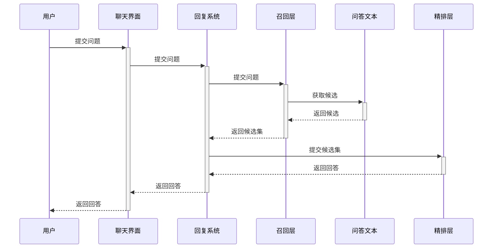

```mermaid
sequenceDiagram
	用户->>+聊天界面: 提交问题
	聊天界面->>+回复系统: 提交问题
	回复系统->>+召回层: 提交问题
	召回层->>+问答文本: 获取候选
	问答文本-->>-召回层: 返回候选
	召回层-->>-回复系统: 返回候选集
	回复系统->>+精排层: 提交候选集
	精排层-->>-回复系统: 返回回答
	回复系统-->>-聊天界面: 返回回答
	聊天界面-->>-用户: 返回回答
	
```

