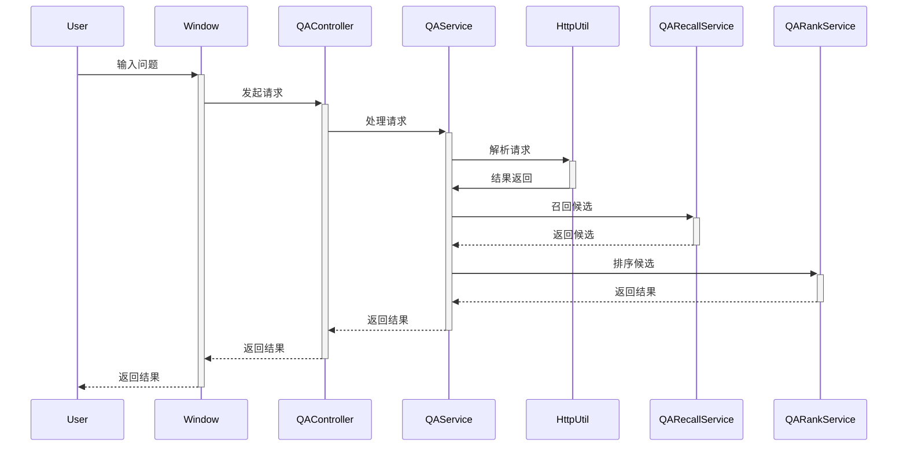

```mermaid
sequenceDiagram
	User->>+Window: 输入问题
	Window->>+QAController: 发起请求
	QAController->>+QAService: 处理请求
	QAService->>+HttpUtil: 解析请求
	HttpUtil->>-QAService: 结果返回
	QAService->>+QARecallService: 召回候选
	QARecallService-->>-QAService: 返回候选
	QAService->>+QARankService: 排序候选
	QARankService-->>-QAService: 返回结果
	QAService-->>-QAController: 返回结果
	QAController-->>-Window: 返回结果
	Window-->>-User: 返回结果
	
```

